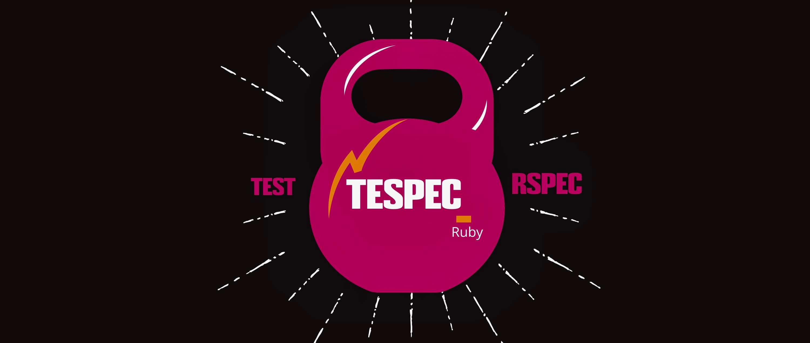

# Basic Page Object Model Framework for selenium with rspec and allure
This framework is to demonstrate the basic Page Object Model for UI automation with selenium in Ruby. For assertion and testing structure we use rspec. For reporting we are going with open sourced allure.

## Prerequsite
* Install RVM in the machine
* Clone the project to a directory.
* Do `gem install bundler` in the folder path "../selenium-ruby-basic" in commandline
* Give `bundle install`
* Required package will be installed from Gemfile.
* Install chromedriver `brew cask install chromedriver` (for mac machines).

## To run the tests
* Now run the test by `rspec spec/we_invest_model_portfolio.rb`
* To get rspec's default html report run by `rspec spec/we_invest_model_portfolio.rb --format html > results/last_run.html`
* Allure report can be get by giving `allure serve reports/allure`
* To run in headless mode uncomment the line '-headless' in 'run_parameters.yml' file and run again.

## Folder Structure Definitions

### Libraries
* Library folder is to have all the common methods that will be used for this project.
* In this sample framework I have driver methods and locator methods.
* In general driver and locator methods has to be imported from a gem. Project specific common methods to be placed under this folder.

### Pages
* This contains the Page methods in the 'Page Object Model'.
* Page module contains classes which inherits the Object classes, from which Pages can refer to the Objects.
* Each definite page in a web application should contain a page class and the actions performed on those pages should be a seperate method in the page class.

### Locators
* This contains Locator (Object) identifier methods in the 'Page Object Model'
* Each definite page in a web application should contain a object class and each object in that page should be declared within this object class.
* This objects can be called from a page method or directly from the model (if needed)

### Spec
* This contains the Tests (Model) defined in the 'Page Object Model'
* Here we can extensively use the Rspec methods and assertions to customize our test run.
* Rspec core documentation - https://rspec.info/documentation/3.9/rspec-core/
* Rspec assertion documentation - https://rspec.info/documentation/3.9/rspec-expectations/
* Rspec mock documentation - https://rspec.info/documentation/3.9/rspec-mocks/

### Test-data
* This folder has all the test data that will be used for this project. 
* Test files can be some upload files, csv, excel, conf, json or even yaml file.
* Here I used YAML file to get the test input data in to the project.
* NO HARDCODING of values inside the project. All the variables has to be mentioned in the test-data folder and fetched inside the project

### Reports / Results
* Reports folder has allure specific result files. These are some xml files which will be used while running `allure serve reports/allure`.
* Results folder has rspec specific result files (If we use command line to get rspec results).

### Gemfile
* All the dependencies should be mentioned here, so that all the gems can be installed in one shot.
* If needed we can specify the gem version for each gems that we use.

### Spec Helper
* Spec helper file will be created inside the Spec foler.
* This file is used to declare all the required gems or folder paths that is needed to run the tests.
* Inside each spec file we need to require only the spec helper file so that each spec is powered to access all the gems or files used within the project.

This is just a beginner level of POM. Ideally we need to make most of the common methods that we use inside this project in to a seperate gem and we need to import that gem.

*Happy Automating*
